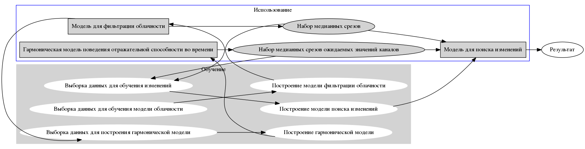

# Рубки: схема работы


## Общее описание схемы работы



Схема работы состоит из нескольких связанных компонентов (скриптов или функций), при этом часть из них используется только на этапе обучения, а часть и при обучении, и при функционировании системы. 

Схема работы состоит из двух основных связанных между собой частей:
 * Набора функций и скриптов, необходимых при использовании модели поиска измененний (т.е. этапа генерации результирующего слоя изменений).
 * Набора функций и скриптов, необходимых для обучения моделей.
Часть функций (например, функции создания медианных срезов) используется и на этапе обучения (для генерации обучающей выборки), и на этапе функционирования (для герерации входных данных для модели).

Общая схема представлена на рисунке. Основные модели на данной схеме описываются в соответствующих подразделах. Более детальное описание функций приводится в конце документа.

### 1. Модель поиска изменений.
Это основной по значимости компонент, который собственно и ищет изменения. Для того, чтобы модель заработала и выдала результат, необходимо подать ей на вход соотвествующим образом подготовленные даннные (результат работы вспомогательных компонентов):
 * набор медианных срезов ToAR за выбранный временной период;
 * набор ожидаемых медианных срезов ToAR (т.е. таких ToAR, которые должны быть в выбранном временном срезе, если бы изменений не было).
На основании этих входных данных модель изменений возвращает растр, в котором закодирована давность изменения.


### 2. Гармоническая модель поведения отражательной способности во времени.
Данная модель строит прогнозные значения ToAR на заданный день года на основе исторических данных за предыдущие годы.
Модель использует в качестве входов:
 * отфильтрованные от облачности значения ToAR за предыдущие годы 
 * даты снимков, с которых были сняты значения ToAR
 Модель возвращает набор коэффициентов, по которым строятся прогнозные значения ToAR на заданную пользователем дату.

### 3. Модель для фильтрации облачности.
Специальная модель, которая используется в дополнение к стандартным методам фильтрации облачности, представленным в GEE. Модель принимает на вход поканальный набор ToAR и возвращает маску облачности.

## Детальное описание функционирования частей

Описание составных компонентов здесь идет от обратного - от конца (генерации модели поиска изменений) к началу (выборке необходимых данных для генерации моделей).

### Модель поиска изменений. 
Модель строится на нейросетевом подходе, обучается при помощи фреймворка TensorFlow.

Обученная модель принимает на вход 
* набор медианных срезов ToAR за выбранный временной период;
 * набор ожидаемых медианных срезов ToAR (т.е. таких ToAR, которые должны быть в выбранном временном срезе, если бы изменений не было).
На основании этих входных данных модель изменений возвращает растр, в котором закодирована давность изменения.

Пример использования обученной модели можно посмотреть [тут](https://code.earthengine.google.com/9e89d65e47a41a5ead3a99e0e6c343ec).

Обучается модель на основе набора csv файлов, содержащих необходимые входные данные и желаемы ответы нейросети. Примеры этих файлов лежат в `data/changes/expectedVSmedian/change_sample_prev*_seed0.csv`

```
python nnet.py --data data/changes/expectedVSmedian/change_sample_prev*_seed0.csv" --layer1 15 --layer2 10 --layer3 5 --max_epoch 100000
```

### Генерация набора ожидаемых значений ToAR
Для того, чтобы создать ожидаемые значения ToAR необходимо:
 * сгенерировать коэффициенты модели поведения ToAR в зависимости от времени (https://code.earthengine.google.com/b77eaa995f734105bb374188e6aa6efc). В результате получается набор растров коэффициентов, которые экспортируются в Asset;
 * на основе коэффициентов можно сгенерировать прогнозируемые на указаную дату значения ToAR (с одновременным вычислением медианы) (https://code.earthengine.google.com/38b81c3d3e6778764e9ffca67887f3ee). Для ускорения работы на этапе исполнения эти прогнозируемые значения рассчитываются заранее и также экспортируются в Asset.

### Фильтрация облачности
Функции фильтрации облачности - вспомогательные и используются дополнительно к соответсвующим функциям GEE. Тем не менее процедура фильрации облаков лежит внизу пирамиды: все последующие более высокоуровневые действия производятся с данными, прошедшими фильтрацию.

В настоящий момент функция фильтрации облаков реализована в виде нейронной сети (https://code.earthengine.google.com/15180614d6b28a476efd8feee92a5455). Нейросеть была обучена на базе R и в ближайшее время эта модель будет создана с использованием TensorFlow (что позволит избавиться от одной лишней зависимости).

### Выборки данных
Для обучения моделей необходимо сгенерировать обучающие выборки, за эти процедуры отвечают отдельные скрипты.

#### Выборка данных для обучения модели изменений
Для того, чтобы обучить модель необходимо предварительно сгенерировать обучающие данные. Генерация их производится тут: https://code.earthengine.google.com/b9f989d1343086bbaef650618972992c

В свою очередь данный скрипт использует несколько вспомогательных частей, необходимых ему в работе:
 * генерация набора ожидаемых значений ToAR;
 * генерация набора медианных ToAR.
 
Результаты работы скрипта (файлы csv) находится в каталоге data/changes/ (различные версии данных)
 
#### Выборка данных для обучения модели фильтрации облачности
Скрипт создания выборки не сохранился, но он был близок к скрипту https://code.earthengine.google.com/b9f989d1343086bbaef650618972992c. Результаты работы этого скрипта (файлы csv) хранятся в каталоге data/clouds

#### Выборка данных для построения гармонической модели
Отдельного скрипта выборки данных не создавалось, поскольку модель обучалась непосредственно в GEE. Поэтому выборка данных и необходимые преобразования производятся непосредственно в скрипте обучения модели https://code.earthengine.google.com/b77eaa995f734105bb374188e6aa6efc
